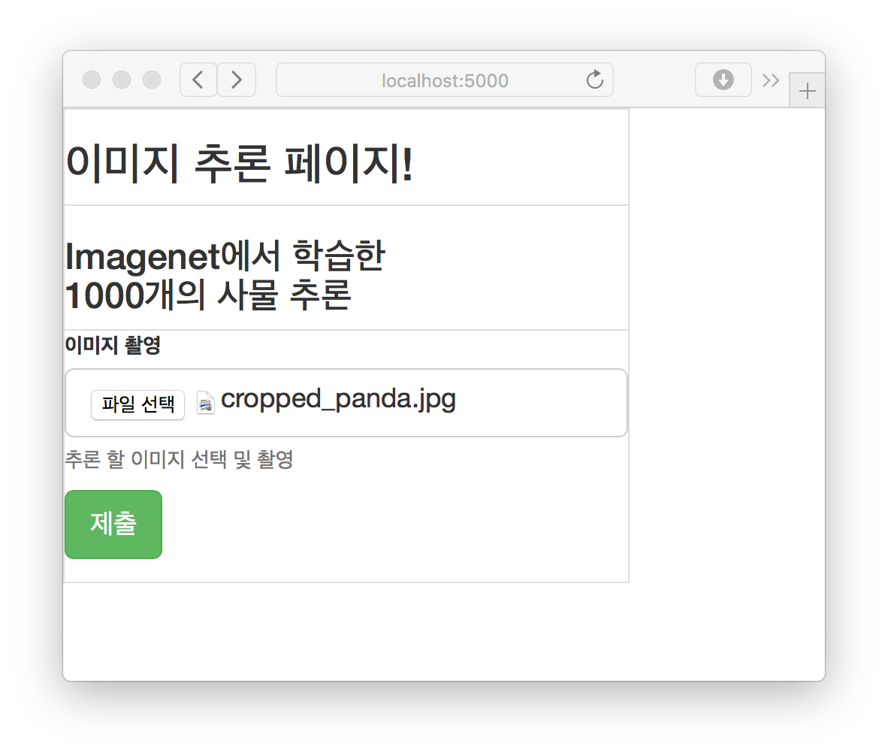
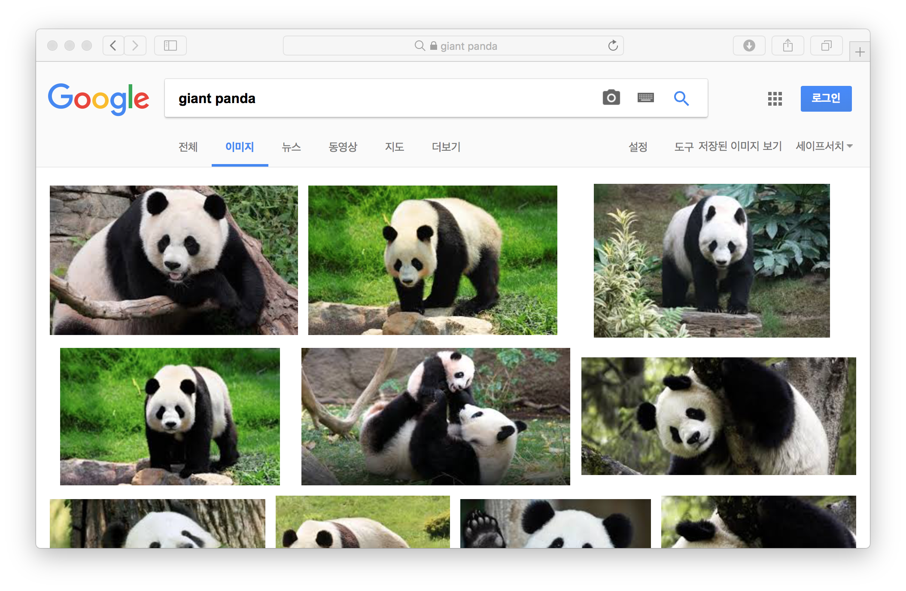

#눈치 Nun-Chi

눈치있게 이미지 추론 하여, 구글 이미지 검색을 통해 결과를 보여 준다
\
데스크탑에서는 이미지 파일을 선택 할 수 있고,\
모바일 에서는 사진을 바로 촬영 할 수 있다

## 개발
- osx, ubuntu
- Anaconda Python 3.6
- Tornado
- Tensorflow

##빠른 테스트
- python tornado_api_server.py
- template/index.htlm 을 예쁘게 다시 만든다 :D

## 한계
- 첫 검색시 tensorflow를 로드하는 시간이 길다 (5초 내외)
- 추론 시간이 PC 성능 영향을 많이 받는다
- Ubuntu에서 메모리를 많이 차지한다

## 스크린샷
메인 화면

결과 출력 화면 (google image search)

